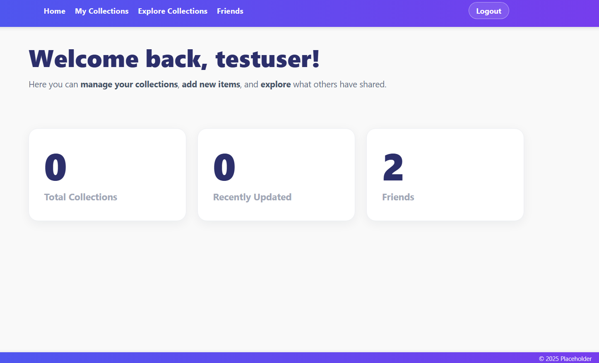
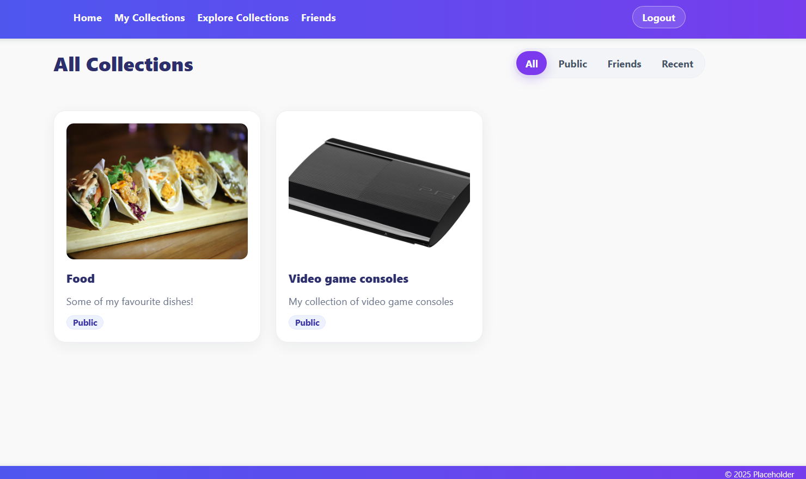
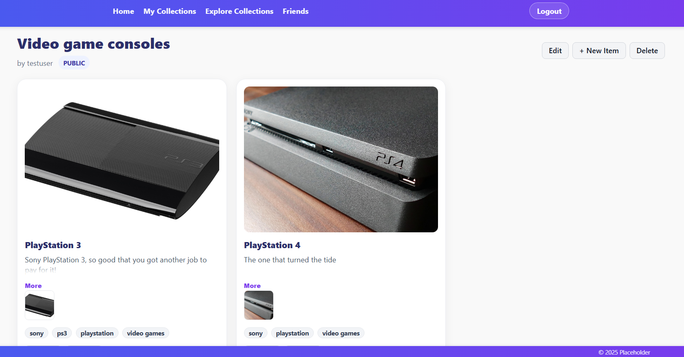
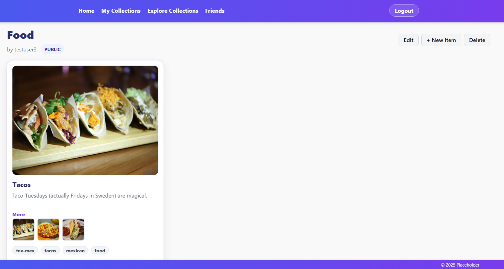
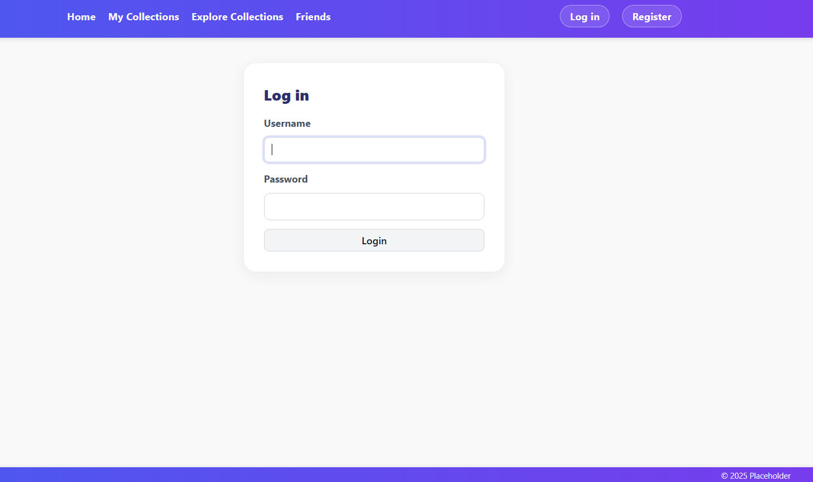
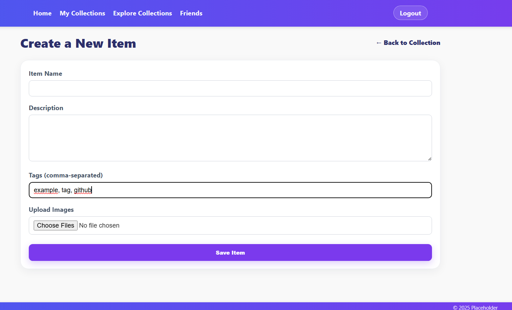

# Collection Manager

A Spring Boot + Thymeleaf web app for organizing your collections and sharing them with others.

> Run locally and sign up with the built-in registration page. See **Getting Started**.

## Features

- Create and manage **Collections** with title, description, and visibility (Public / Friends / Private)
- Add **Items** with images, tags, and descriptions
- Image **thumbnails** + **modal** full-size view
- **Friends**: request/accept, see friends’ collections when visibility allows
- Authentication (register/login/logout) via Spring Security
- Modern, clean UI with cohesive layout and design

## Screenshots

<table>
  <tr>
    <td align="center" width="50%">
      <a href="screenshots/home.png?raw=1">
        
      </a><br>
      <sub><b>Home</b></sub>
    </td>
    <td align="center" width="50%">
      <a href="screenshots/collections-grid.png?raw=1">
        
      </a><br>
      <sub><b>Collections grid</b></sub>
    </td>
  </tr>

  <tr>
    <td align="center" width="50%">
      <a href="screenshots/collection.png?raw=1">
        
      </a><br>
      <sub><b>Collection</b></sub>
    </td>
    <td align="center" width="50%">
      <a href="screenshots/item.png?raw=1">
        
      </a><br>
      <sub><b>Item</b></sub>
    </td>
  </tr>

  <tr>
    <td align="center" width="50%">
      <a href="screenshots/login.png?raw=1">
        
      </a><br>
      <sub><b>Login</b></sub>
    </td>
    <td align="center" width="50%">
      <a href="screenshots/create-item.png?raw=1">
        
      </a><br>
      <sub><b>Create item form</b></sub>
    </td>
  </tr>
</table>


## Tech Stack

- **Backend:** Java, Spring Boot, Spring MVC, Spring Security, Spring Data JPA
- **View:** Thymeleaf
- **DB:** MySQL
- **Build:** Maven (wrapper included)
- **Styling:** CSS

## License
MIT — see [LICENSE](LICENSE).

---

## Getting Started

### Prerequisites
- **JDK 21+** (17+ should work too but has not been tested)
- **MySQL 8+**
- **Git & Maven** (`./mvnw` or `mvnw.cmd`)

### 1) Clone
```bash
git clone https://github.com/Andreas-Mollberg/collection-manager-portfolio-project.git
cd collection-manager-portfolio-project
```

### 2) Configure your local `application.properties`

`src/main/resources/application.properties` is **gitignored**. Copy the committed example and edit it:

**macOS / Linux**
```bash
cp src/main/resources/application-example.properties src/main/resources/application.properties
```

**Windows PowerShell**
```powershell
Copy-Item src/main/resources/application-example.properties src/main/resources/application.properties
```

**Windows CMD**
```bat
copy src\main\resources\application-example.properties src\main\resources\application.properties
```

Then open `src/main/resources/application.properties` and set your DB user/password, etc.

### 3) Create the database
Create a MySQL database (default dev setup)
```sql
CREATE DATABASE collection_db CHARACTER SET utf8mb4 COLLATE utf8mb4_0900_ai_ci;
```

### 4) Create the uploads directory
This app serves uploaded images from a local folder:

**macOS / Linux**
```bash
mkdir -p uploads
```

**Windows PowerShell**
```powershell
New-Item -ItemType Directory -Force uploads
```

### Run the app (dev mode)

**macOS / Linux**
```bash
./mvnw spring-boot:run
```

**Windows PowerShell**
```powershell
mvnw.cmd spring-boot:run
```

Visit: http://localhost:8080

Register a user, then create your first collection.

### Build a runnable JAR

**macOS / Linux**
```bash
./mvnw clean package
```

**Windows**
```powershell
mvnw.cmd clean package
```

Now run the built jar (use the exact filename printed by the build):

**macOS / Linux**
```bash
ls target/*.jar
java -jar target/<the-jar-you-just-saw>.jar
```

**Windows PowerShell**
```powershell
Get-ChildItem target/*.jar
java -jar target/<the-jar-you-just-saw>.jar
```


### Project Structure
```
src/
  main/
    java/...                # Spring Boot code (controllers, services, repositories, security)
    resources/
      templates/            # Thymeleaf templates (navbar, footer, pages, fragments)
      static/
        css/                # css files
      application-example.properties  # committed example (safe)
uploads/                    # local image storage (gitignored)
```
### Ideas for further development
- **Search & Filtering**: Search collections by title, tags, or owner
- **Collection Categories**: Organize collections into categories
- **Import/Export**: Backup collections as JSON/CSV
- **Social Features**: Comments, likes, and sharing
- **Advanced Privacy**: Granular permissions per collection
- **API Documentation**: REST API with Swagger/OpenAPI
- **Image Handling**: external storage, resizing/optimization
- **Security**: Change hardcoded values in application.properties to environment variables


## About This Project

The aim of this portfolio project is to demonstrate:
- Full-stack development with Spring Boot

- Clean separation of concerns

- Accessible, responsive CSS with a shared design

- Authentication/authorization with Spring Security

- Relational modeling with JPA
```
